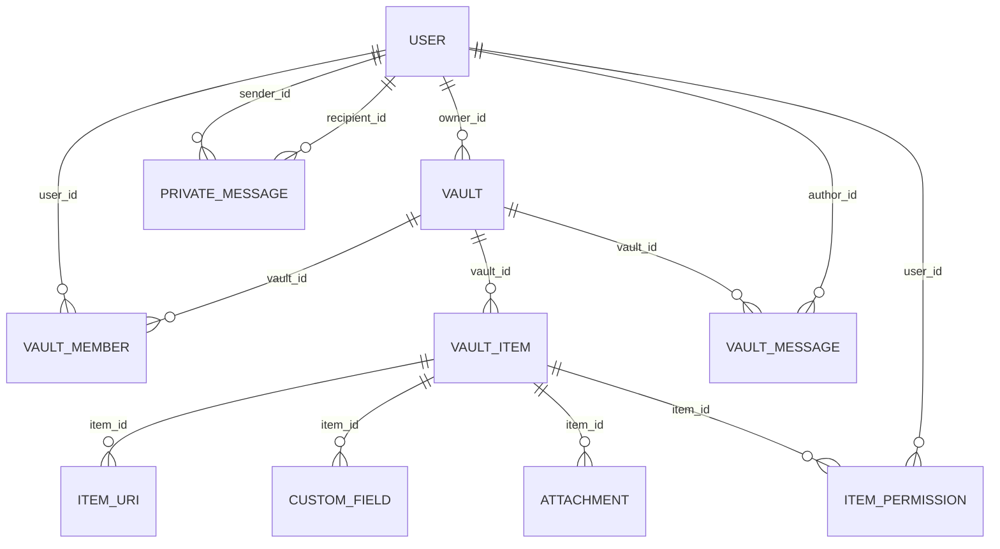

# Base de donnees

## Technologie

- PostgreSQL 16
- ORM : Doctrine (Symfony)

## Entites principales

- `User` : compte utilisateur, profil, securite.
- `Vault` : trousseau personnel/partage.
- `VaultMember` : rattachement utilisateur <-> trousseau + role.
- `VaultItem` : element stocke dans un trousseau.
- `ItemUri` : URLs associees a un item.
- `CustomField` : champs personnalises d'un item.
- `Attachment` : pieces jointes d'un item.
- `ItemPermission` : permissions fines par item.
- `PrivateMessage` : messagerie privee.
- `VaultMessage` : messagerie de groupe par trousseau.
- `OAuthAccount` : liaison compte local <-> fournisseur OAuth.

## Schema relationnel (vue synthetique)

## Contraintes metier cles

- Un item appartient toujours a un trousseau.
- Un membre doit exister pour acceder a un trousseau partage.
- Les actions sensibles sont protegees par permissions et voters.
- Les secrets d'items sont chiffres cote backend avant persistance.
- Les pieces jointes sont stockees hors base ; la table ne conserve que les metadonnees et le chemin de stockage.

## Index et performance

- Index recommandes sur :
  - `vault_member(vault_id, user_id)`
  - `vault_item(vault_id, updated_at)`
  - `vault_message(vault_id, created_at)`
  - `private_message(sender_id, recipient_id, created_at)`
  - `attachment(item_id, created_at)`

## Migrations et exploitation

- Les migrations vivent dans `apps/api/migrations`.
- Appliquer les migrations via Symfony : `php bin/console doctrine:migrations:migrate`.
- Les commandes de maintenance (seed, rattrapage, chiffrement legacy) vivent dans `apps/api/src/Command`.
