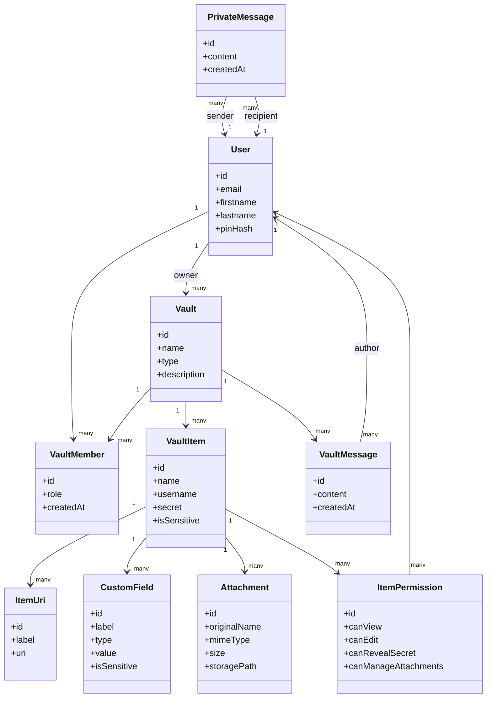
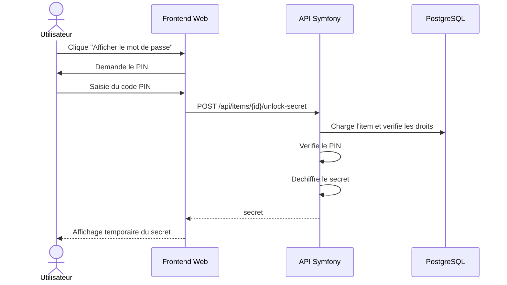

# Diagrammes UML

## Diagramme de classes (metier principal)

```mermaid
classDiagram
  class User {
    +id
    +email
    +firstname
    +lastname
    +pinHash
  }

  class Vault {
    +id
    +name
    +type
    +description
  }

  class VaultMember {
    +id
    +role
    +createdAt
  }

  class VaultItem {
    +id
    +name
    +username
    +secret
    +isSensitive
  }

  class ItemUri {
    +id
    +label
    +uri
  }

  class CustomField {
    +id
    +label
    +type
    +value
    +isSensitive
  }

  class Attachment {
    +id
    +originalName
    +mimeType
    +size
    +storagePath
  }

  class ItemPermission {
    +id
    +canView
    +canEdit
    +canRevealSecret
    +canManageAttachments
  }

  class VaultMessage {
    +id
    +content
    +createdAt
  }

  class PrivateMessage {
    +id
    +content
    +createdAt
  }

  User "1" --> "many" Vault : owner
  User "1" --> "many" VaultMember
  Vault "1" --> "many" VaultMember
  Vault "1" --> "many" VaultItem
  VaultItem "1" --> "many" ItemUri
  VaultItem "1" --> "many" CustomField
  VaultItem "1" --> "many" Attachment
  VaultItem "1" --> "many" ItemPermission
  ItemPermission "many" --> "1" User
  Vault "1" --> "many" VaultMessage
  VaultMessage "many" --> "1" User : author
  PrivateMessage "many" --> "1" User : sender
  PrivateMessage "many" --> "1" User : recipient
```

## Diagramme de sequence (deverrouillage d'un secret sensible)

```mermaid
sequenceDiagram
  actor U as Utilisateur
  participant W as Frontend Web
  participant A as API Symfony
  participant D as PostgreSQL

  U->>W: Clique "Afficher le mot de passe"
  W->>U: Demande le PIN
  U->>W: Saisie du code PIN
  W->>A: POST /api/items/{id}/unlock-secret
  A->>D: Charge l'item et verifie les droits
  A->>A: Verifie le PIN
  A->>A: Dechiffre le secret
  A-->>W: secret
  W-->>U: Affichage temporaire du secret
```
